# RTL Design & Synthesis Workshop

Hands-on internship covering Verilog RTL design, logic synthesis, and flop coding styles using open-source EDA tools.

---

## Module 1 – Introduction to Verilog RTL Design & Synthesis

### Step 1 – Simulate with iverilog

```bash
sudo apt install iverilog gtkwave
iverilog -o sim design.v testbench.v
./sim
```

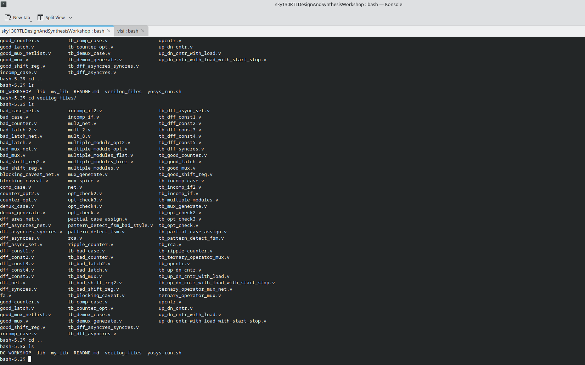

### Step 2 – View waveforms in GTKWave

```bash
gtkwave dump.vcd
```

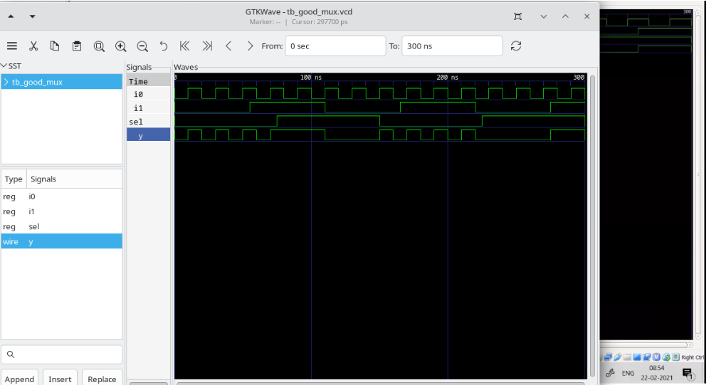

### Step 3 – Synthesise with Yosys

```bash
yosys
> read_liberty -lib sky130_fd_sc_hd__tt_025C_1v80.lib
> read_verilog good_mux.v
> synth -top good_mux
```

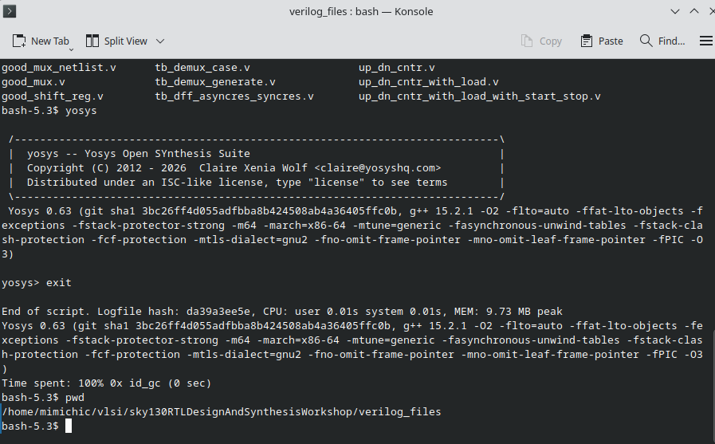

### Step 4 – Map to standard cells and write netlist

```bash
> abc -liberty sky130_fd_sc_hd__tt_025C_1v80.lib
> show
> write_verilog -noattr netlist.v
```

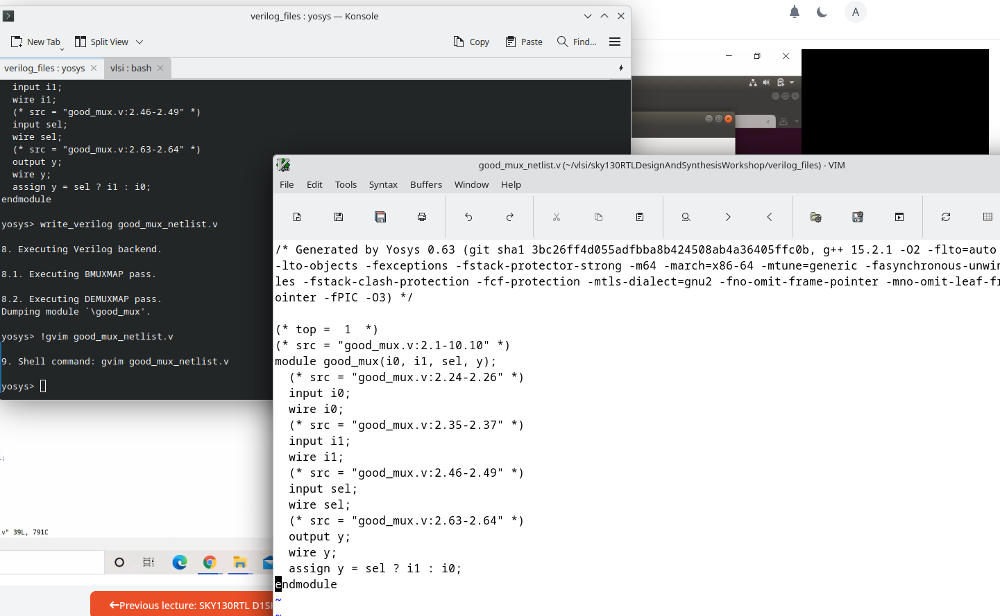
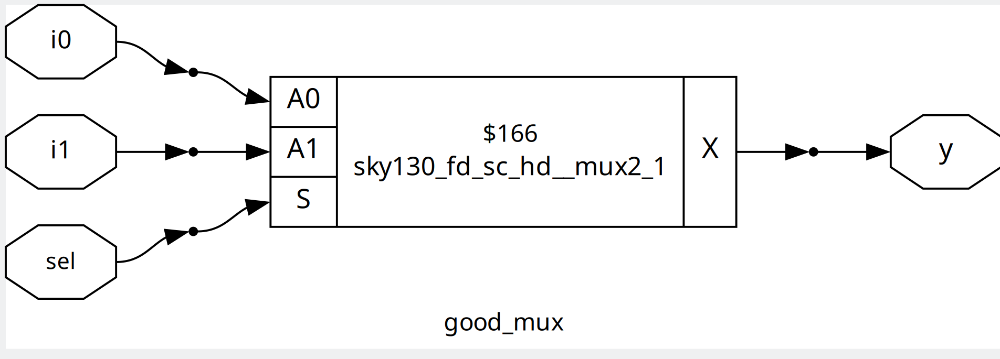

### Step 5 – Verify against Sky130 PDKs

Re-run the testbench on the synthesised netlist to confirm it matches RTL simulation.

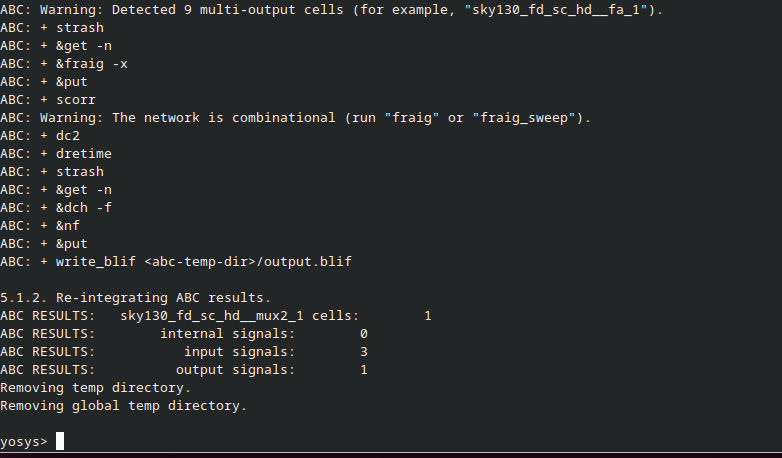

---

## Module 2 – Timing Libs, Hierarchical vs Flat Synthesis & Flop Coding Styles

### Step 6 – Explore timing libraries

Open the Sky130 `.lib` file and study cell attributes: timing arcs, drive strength, and power.

```bash
gvim sky130_fd_sc_hd__tt_025C_1v80.lib
```

### Step 7 – Hierarchical vs Flat Synthesis

**Hierarchical** – sub-module boundaries preserved:

```bash
> synth -top multiple_modules
> show multiple_modules
```

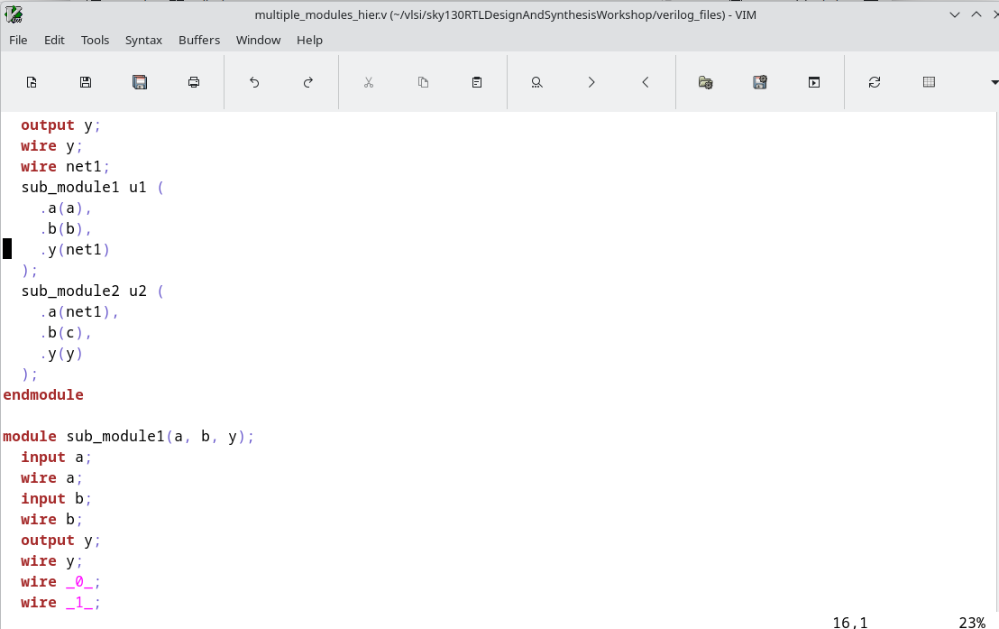

**Flat** – all hierarchy dissolved into one netlist:

```bash
> flatten
> show
```

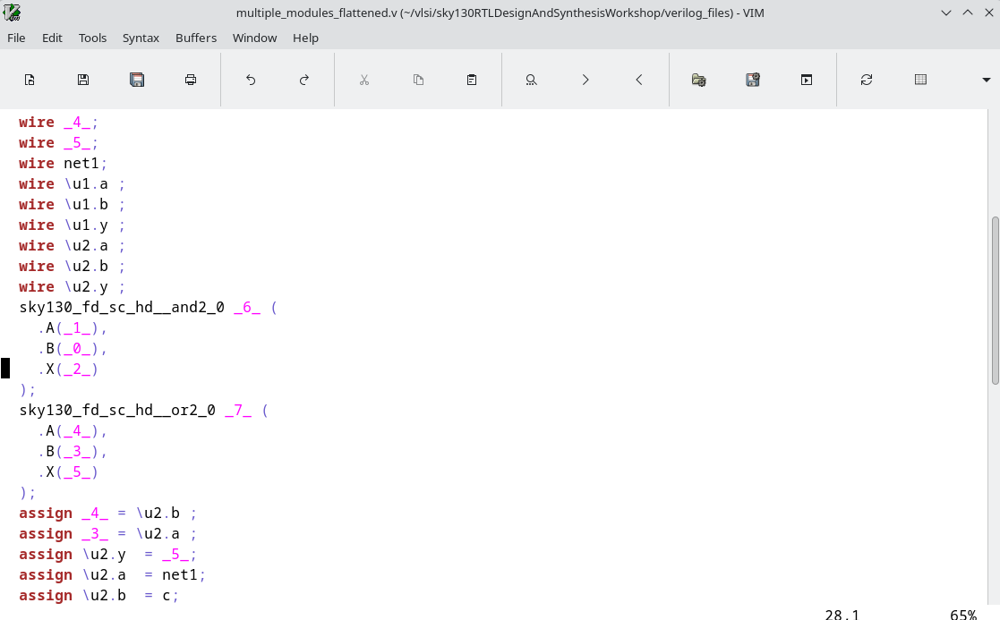
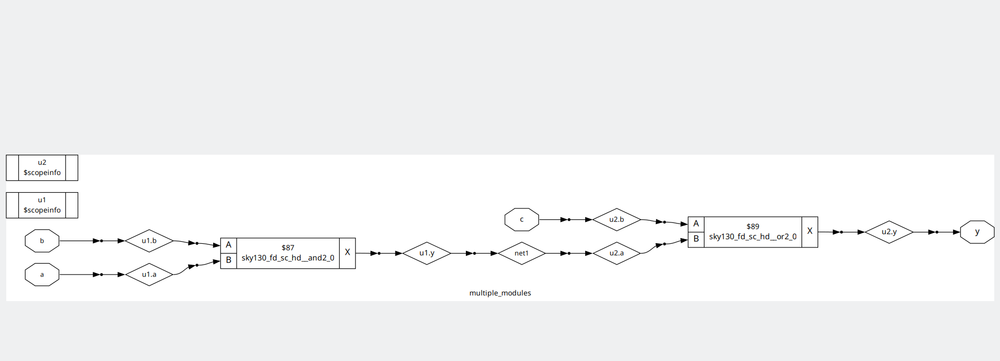

**Sub-module synthesis** – useful for large or repeated blocks:

```bash
> synth -top sub_module1
```

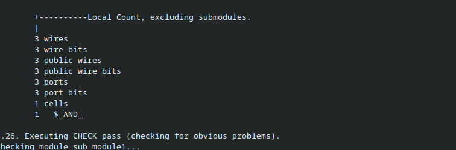

### Step 8 – Flop Coding Styles

Simulate and synthesise different D flip-flop variants. Run `dfflibmap` before ABC to pick the correct flip-flop cells:

```bash
> dfflibmap -liberty sky130_fd_sc_hd__tt_025C_1v80.lib
> abc -liberty sky130_fd_sc_hd__tt_025C_1v80.lib
> show
```

| Style | Simulation | Schematic |
|-------|-----------|-----------|
| Async reset | 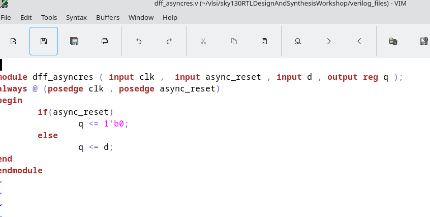 | 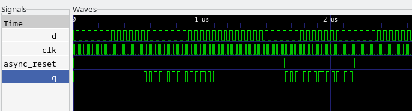 |
| Async set | 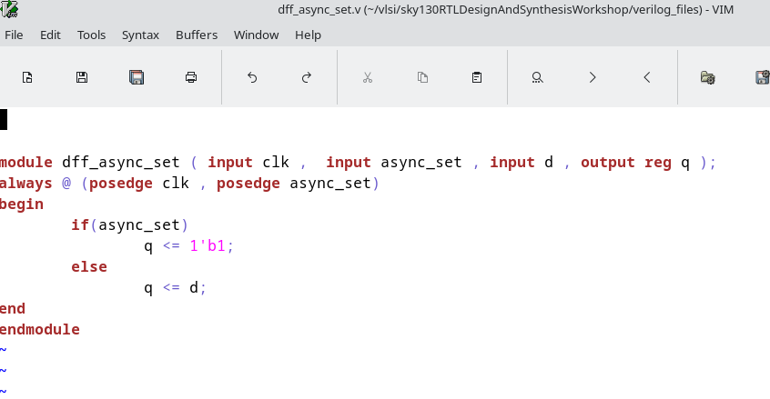 | 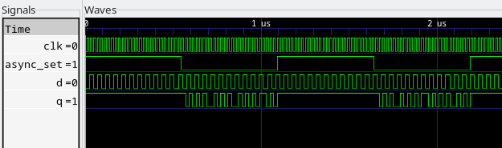 |
| Sync reset | 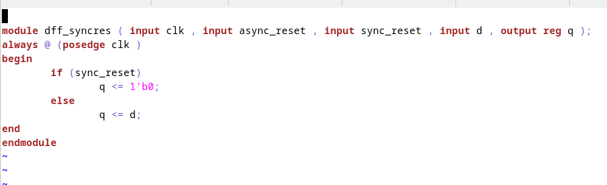 | 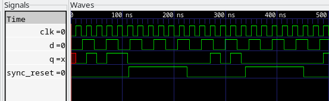 |

### Step 9 – Special optimisations (mult2, mult8)

Multiplying by powers of 2 is a left-shift in binary — Yosys maps these with zero standard cells, purely through rewiring.

```bash
> synth -top mult2
> abc -liberty sky130_fd_sc_hd__tt_025C_1v80.lib   # reports 0 cells
> show
```

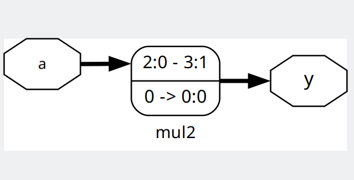
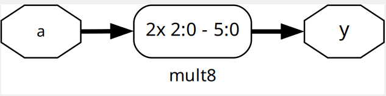

---

## Tools Used

- [iverilog](http://iverilog.icarus.com/) – Verilog simulation
- [GTKWave](http://gtkwave.sourceforge.net/) – Waveform viewer
- [Yosys](https://yosyshq.net/yosys/) – Logic synthesis
- [Sky130 PDK](https://github.com/google/skywater-pdk) – Standard cell library
